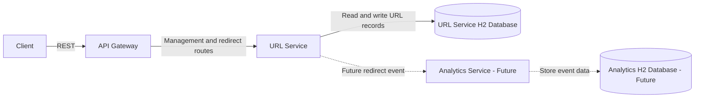
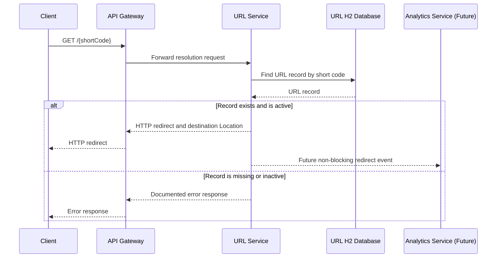

# Architecture

## High Level Architecture

The target system is a small REST-based microservice architecture for URL creation, lookup, and redirection. An API Gateway is the public entry point. It routes requests to the URL Service, which owns the URL lifecycle and redirect-resolution logic. An Analytics Service is defined as a future, separately deployable boundary for recording redirect events; it is not implemented in the initial assignment scope.

Services communicate synchronously over HTTP. Each service owns its data store. For local development, H2 supplies simple embedded relational persistence without external infrastructure.

## Why Microservices

Microservices provide explicit ownership boundaries for the parts of the system that will evolve at different rates:

- URL management requires strong validation, uniqueness, and link lifecycle rules.
- Redirect resolution is latency-sensitive and can scale independently from management traffic.
- Analytics is write-heavy and can grow independently of the primary URL lifecycle.

For this assignment, these boundaries are architectural rather than an invitation to add operational complexity. The initial implementation remains small, uses REST only, and excludes service discovery, messaging, distributed caching, and container orchestration.

## Service Responsibilities

| Component | Responsibilities | Owns |
| --- | --- | --- |
| API Gateway | Public request entry, routing, cross-cutting request handling, and consistent external error boundaries. | Route configuration and gateway-level policies. |
| URL Service | Short-code generation, destination validation, URL lifecycle management, metadata lookup, and redirect eligibility/resolution. | URL records and business rules. |
| Analytics Service | Future capture, storage, and query of redirect events and aggregate metrics. It is not part of the initial functional release. | Analytics events and derived aggregates. |

## API Gateway Responsibilities

- Provide a single public base URL for client requests.
- Route management requests, such as `/api/v1/urls`, to the URL Service.
- Route short-code resolution requests, such as `/{shortCode}`, to the URL Service.
- Apply request correlation identifiers and forward them to downstream services.
- Enforce gateway-level request size limits and return consistent responses for routing failures.
- Keep business validation and URL persistence out of the gateway.

Authentication, authorization, rate limiting, and TLS termination are not implemented in the initial assignment. Their future introduction must remain gateway concerns rather than URL-domain concerns where appropriate.

## URL Service Responsibilities

- Validate destination URLs as absolute HTTP or HTTPS addresses.
- Generate URL-safe short codes and prevent collisions through persistence-level uniqueness.
- Create, retrieve, update, activate, and deactivate shortened URL records.
- Resolve an active short code to its destination URL.
- Return domain-appropriate outcomes for unknown, malformed, or inactive short codes.
- Persist URL data in its own H2 database during local development.
- Keep controller, service, domain, and persistence responsibilities separate within the service.

## Analytics Service Responsibilities

The Analytics Service is a documented future boundary and is intentionally not implemented in this commit or the initial functional scope.

When introduced, it will:

- Record redirect events without changing URL Service ownership of link data.
- Store event attributes such as short code, timestamp, and non-sensitive request context.
- Produce aggregate usage metrics for a short code.
- Apply retention and privacy policies before exposing analytics data.

The current constraints prohibit Kafka, RabbitMQ, and Redis. A later implementation can begin with a synchronous HTTP notification or a persisted outbox pattern, chosen only when analytics becomes in scope.

## H2 Database Usage

H2 is used only for local development and automated testing. It keeps the assignment self-contained, supports relational constraints such as a unique short code, and allows repeatable test data setup.

The URL Service owns an H2 database containing URL records. The future Analytics Service would own a separate H2 database for its event data. No service reads another service's tables directly. Database access is isolated behind repository and service layers so H2 can later be replaced with a production relational database without changing REST contracts.

H2 is not a production durability or scaling strategy: data may be reset locally, and database behavior must be verified against a production database before a production release.

## Request Flow

### Create a Short URL

1. A client sends `POST /api/v1/urls` to the API Gateway.
2. The gateway assigns or forwards a correlation identifier and routes the request to the URL Service.
3. The URL Service validates the destination URL, generates a candidate short code, and saves the record.
4. A uniqueness conflict causes the service to generate another candidate short code.
5. The URL Service returns the created resource representation through the gateway.

### Resolve a Short URL

1. A client sends `GET /{shortCode}` to the API Gateway.
2. The gateway routes the request to the URL Service.
3. The URL Service retrieves the URL record and verifies that it is active.
4. For an active record, the service returns an HTTP redirect with the destination URL.
5. For an unknown or inactive record, the service returns a documented non-redirect response.
6. A future Analytics Service may record the successful redirect without blocking the redirect response.

## Component Diagram



## Sequence Diagram



## Folder Structure

The current repository contains documentation only. The planned structure is:

```text
.
|-- docs/
|   |-- Architecture.md
|   |-- BRD.md
|   `-- Decision-Log.md
|-- api-gateway/                 # Future Spring Boot gateway module
|-- url-service/                 # Future Spring Boot URL lifecycle module
|-- analytics-service/           # Future Spring Boot analytics module
|-- pom.xml                      # Future Maven parent build
`-- README.md
```

Each future service module will keep application code, tests, and configuration within its own boundary. The listed modules are architectural intent only and are not created by this documentation commit.

## Design Decisions

- Use REST for synchronous, easily inspectable service communication.
- Make the API Gateway the only public routing boundary.
- Assign URL lifecycle ownership exclusively to the URL Service.
- Keep analytics isolated and deferred because it is not required for core URL shortening.
- Give each service independent data ownership; cross-service database access is prohibited.
- Use H2 to make local execution and tests self-contained.
- Keep all management endpoints versioned under `/api/v1` while preserving a concise redirect route.

## Tradeoffs

| Decision | Benefit | Cost |
| --- | --- | --- |
| Microservice boundaries | Clear ownership and independent future scaling. | More modules and HTTP hops than a modular monolith. |
| API Gateway | Single public edge and centralized routing. | Adds another runtime component. |
| H2 for local persistence | Zero external setup and fast tests. | Does not represent production durability or database behavior fully. |
| Synchronous REST | Simple debugging and familiar failure model. | Downstream availability can affect request latency. |
| Deferred analytics | Keeps the initial release focused. | No click visibility until the capability is implemented. |

## Risks

| Risk | Impact | Mitigation |
| --- | --- | --- |
| Short-code collision | Failed creation or incorrect mapping if uniqueness is weak. | Enforce a database uniqueness constraint and retry generation. |
| Gateway outage | Public API requests cannot reach services. | Keep gateway configuration minimal and test route behavior. |
| Redirect latency | User-facing redirects slow under load. | Keep resolution path limited to a single indexed lookup. |
| Analytics coupling | Event capture could delay redirects. | Treat analytics as non-blocking and isolate it from redirect success. |
| H2 differences | Production behavior may differ from local tests. | Add production database compatibility testing before production use. |
| Open redirect abuse | Short links can conceal undesirable destinations. | Restrict schemes to HTTP/HTTPS and consider reputation controls later. |

## Scalability Considerations

- Redirect traffic is expected to be read-heavy; the URL Service can be scaled independently from management operations.
- The short-code column must be uniquely indexed to keep resolution lookups efficient.
- H2 is suitable only for local use; production readiness requires a durable relational database per service.
- The Analytics Service must scale independently because event ingestion can become much larger than URL creation volume.
- Future caching, rate limiting, asynchronous analytics delivery, and observability may be introduced when justified by measured load. They are deliberately excluded from the initial assignment.